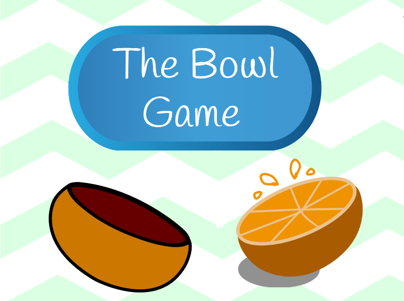

<link href="style.css" rel="stylesheet"></link>

# The Bowl Game
The Bowl Game is my first project for Harvard's CS50 course using the Scratch programming language by MIT. Have fun playing the game!

# Mechanics
Game objective:
* Empty at least three bowls to complete the game.

The rules of the game are as follows:
* Press the green button to generate orange slices which will more around the screen.
* Collect the orange slices by touching them with the bowl.
* Reposition the bowl by dragging and dropping it in the play area (or using the arrow keys)
* When the bowl is full, it can no longer collect more orange slices. Empty the bowl by touching the "Empty Bowl!" square.
